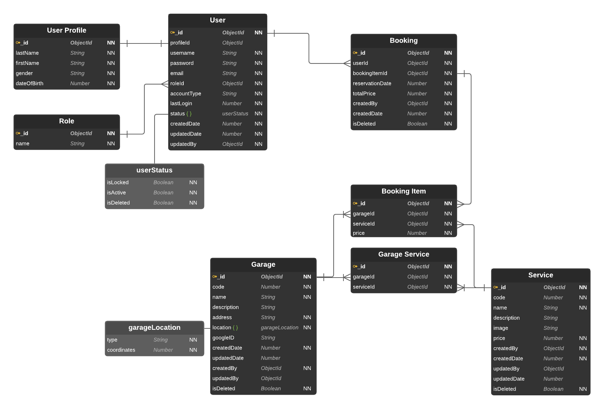

# GARAGE BOOKING - PRODUCT SPECIFICATION DOCUMENT

## Introduction

### `Purpose`

The purpose of this document is to present a detailed description of the Web Garage Services Booking. It will explain:

- The purpose and features of the website.
- The interfaces of the system
- What the system will do.
- The constraints under which it must operate and how the system react to external stimuli.

The document is intended for both stakeholders and the developers of the system.

### `Intended Audience and Reading Suggestions`

Primary readers of this document are the developers, team members and stakeholders of this project. Secondary readers are administrators or people interested in the project.

Contributors to this document are the members of the team.

The following document contains the functional, user and design requirements for Garage Services Booking application and supporting software, as well as user manuals, project information and planning.

### `Project Scopes`

This software system will be a Web Publishing System for a Garage Services Booking Company.
More specifically, this system is designed to allow administrators to manage:

- The booking orders from clients.
- The services of company.
- The garages of company.
- The clients who use the website.

The system also contains a relational database containing a list of Users, Services, Garages and Booking.

### `Glossary`

**Database**:
Collection of all the information monitored by this system.

**Actor**:
Administrator of the website, or web user.

**Field**:
A cell within a form.

**Product Specification**:
A document that completely describes all of the functions of a proposed system and the constraints under which it must operate.

**Stakeholder**:
Any person with an interest in the project who is not a developer.

## Overall Description

### `Product Features`

#### **Major features**

- Authorization Sites
  - Register
  - Login
    - Internal Login
    - Social Login
  - Verify Account
  - Recover Password
- Personal Profile Sites
  - Profile Detail
  - Edit profile page
- Garage Sites
  - Garage List Page
  - Garage Detail Page
- Service Sites
  - Service List Page
  - Service Detail Page
- Booking Sites
  - Create booking Page
  - Booking List Page
  - Booking Detail Page
- Minor Features
  - Home Page

#### **Admin features**

- Dashboard Sites
  - Users Management Sites
    - Users List Page
    - User Detail Page
    - Edit User Page
    - Delete User Page
  - Garages Management Sites
    - Garages List Page
    - Add Garage Page
    - Edit Garage Page
    - Delete Garage Page
  - Services Management Sites:
    - Services List Page
    - Add Service Page
    - Edit Service Page
    - Delete Service Page
  - Booking Management Sites:
    - Booking List Page
    - Booking Detail Page
    - Delete Booking Page

### User Classes and Characteristics

There are two types of users: mobile, web and administrators.

The project's main audience is web users who is customer of the Garage Services Booking Company. Users will be able to use all the features of role user of the project.

Second users are mobile users. There users are also the customers or someone who interested in garage services. They will be able to use all the features as web non-mobile but not make sense for their context in some case.

Admin users are typically on a non-mobile device and control all the data of system.

### `Design and Implementation Constraints`

#### ERD



#### Implementation Constraints

**Back-end**

- Programming Languages: Typescript
- Technologies used
  - Node.js
  - Express.js
  - Mongoose
  - Bcrypt
  - Jest
  - Class-validator
  - Winston
  - Morgan
  - @google-cloud/storage
  - Swagger
  - Inversify
  - EditorConfig
  - ESLint
  - Prettier
  - Husky
- Technical Constraints
  - Apply SOLID principle.
  - Resource files upload must be less then 10MB.
  - Dependency Injection.
  - Geo Location supported browsers.
- Database: MongoDB
- Software Dependencies:
  - Google Maps API

- Project structure:

  ``` typescript
  src
  ├── controllers/
  ├── dtos/
  ├── exceptions/
  ├── interfaces/
  ├── middlewares/
  ├── models/
  ├── repositories/
  ├── routes/
  ├── services/
  ├── tests/
  ├── utils/
  ├── inversify.config.ts
  ├── types.ts
  ├── server.ts
  └── app.ts
  ```

### User Documentation

**Front-end**

- Technologies used
  - Angular
  - HTML
  - Material CSS
  - angularx-social-login
- Technical Constraints
  - Apply SOLID principle
  - Resource files upload must be less then 10MB
  - Dependency Injection
  - Geo Location supported browsers
- Project structure:
  
  ``` typescript
  app
  ├── configs/
  ├── core/
  ├── data/
  ├── layout/
  ├── modules/
  │   └── auth/
  │       └── page/
  │           │── login/
  │           └── register/
  ├── app-routing.module.ts
  ├── app.component.html
  ├── app.component.scss
  ├── app.component.ts
  ├── app.module.ts
  └── material.module.ts
  ```

### Assumptions and Dependencies

This project is dependant on the Google API and Heroku, the use of google cloud storage to store service's images and the supporting staff to develop and maintain it.

It is assumed Google will continue supporting their free APIs.

It is assumed Google CLoud Storage will continue to support development and hosting of the project.

## System features

### `Front-end`

#### Welcome page

**Description**
The page includes:

- 2 buttons: login button and register button. These button link to login and register pages.
- Logo and info about site.

**Functional requirements**
Navigate to Login page:

- User clicks on login button.
- The system redirects user to login page.

Navigate to Register page:

- User clicks on register button.
- The system redirects user to register page.

#### Register page

**Description**
The page include 2 buttons: login button and register button (these button link to login and register pages); 4 fields: username, email, password, confirm password; create account button
Page also include logo and info about site

**Functional requirements**
Navigate to Login page:

- User clicks on login button
- The system redirects user to login page

Navigate to Register page:

- User clicks on register button
- The system redirects user to register page

Register for a new account:

- User enters username, email and password
- The system validates user inputs
- User clicks Create button
- The system sends verification email to user
- User click on the verification link
- System redirect user to verify page
- Account created

#### Login page

**Description**
The page includes:

- 2 buttons: login button and register button (these button link to login and register pages).
- 4 fields: username, password; login button; login with google button.
- Logo and info about site.

**Functional requirements**

Navigate to Login page
  
- User clicks on login button
- The system redirects user to login page

Navigate to Register page:

- User clicks on register button.
- The system redirects user to register page.

Login with internal account:

- User enter username and password.
- The system validates user inputs.
- User clicks on the Login button.
- The system redirect user to user page or admin page if login successfully. If not, the system displays error message.

Login with google account:

- User click on Login with google button
- User enter Google account and password
- The system redirect user to user page or admin page if login successfully. If not, the system displays error message

#### Admin Page

## External Interface Requirements

### `Hardware Interfaces`

#### Device support

- iOS and Android smartphones
- Windows, Linux, MacOS computer

#### Browser Support

- Chrome
- Mozilla Firefox
- Microsoft Edge
- Opera

#### Software Interfaces

- Google OAuth 2.0 API

## Other Nonfunctional Requirements

### `Software Quality Attributes`

- MVC code base
- REST code base.
- Dependency Injection code base.
- Unit tests for Authentication and User APIs.
